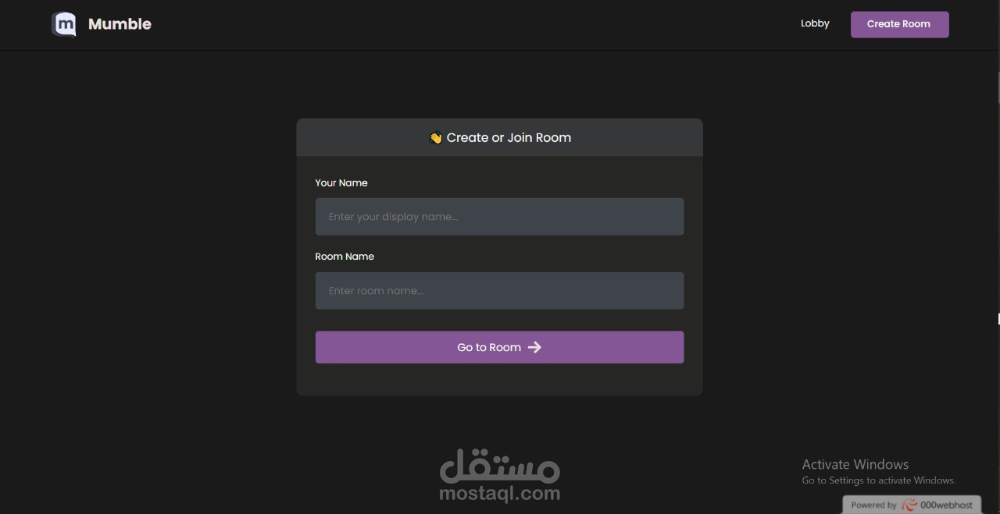
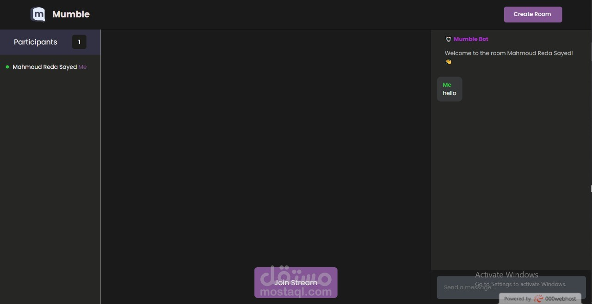
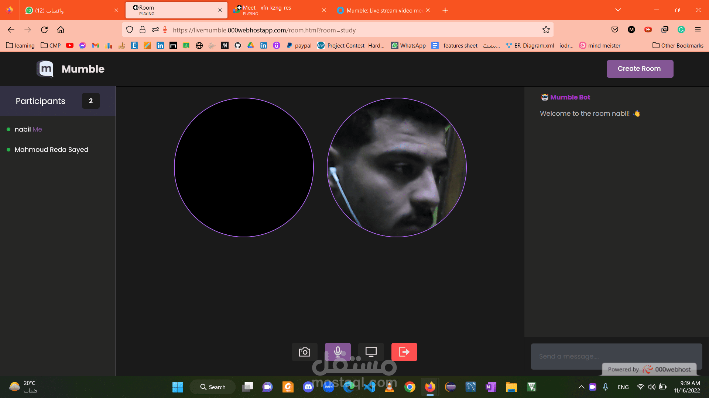
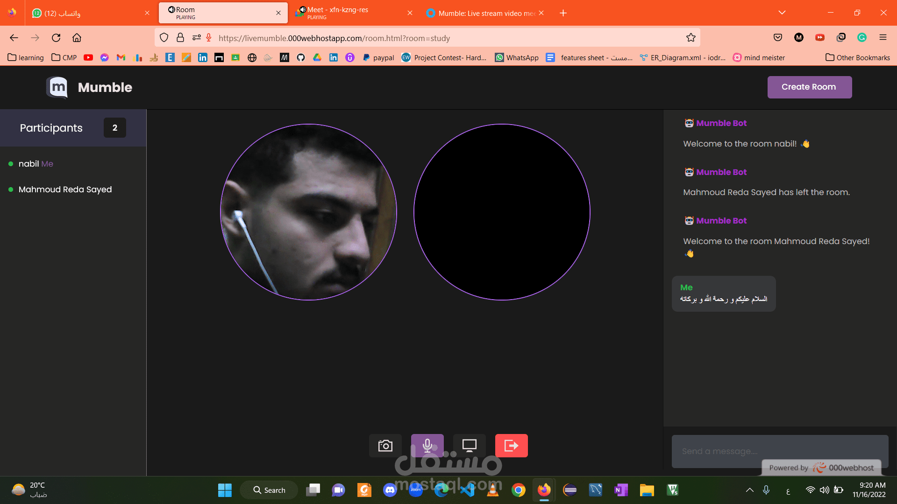
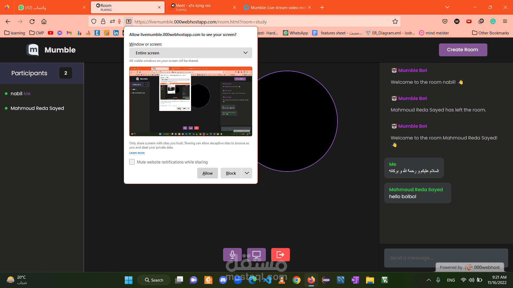

# Mumble
Mumble is a video meet application that allow the users do their meetings or video chats on it. It has chat,share screen and video recording. I implemented it 2 months ago. you can review the project from its link below
https://livemumble.000webhostapp.com/

## Features Implemented
- Video Chat via sharing Unique Meeting Code
- Allows simultaneous text chat during the Video Call  
- Ability to share screen

## ScreenShots

